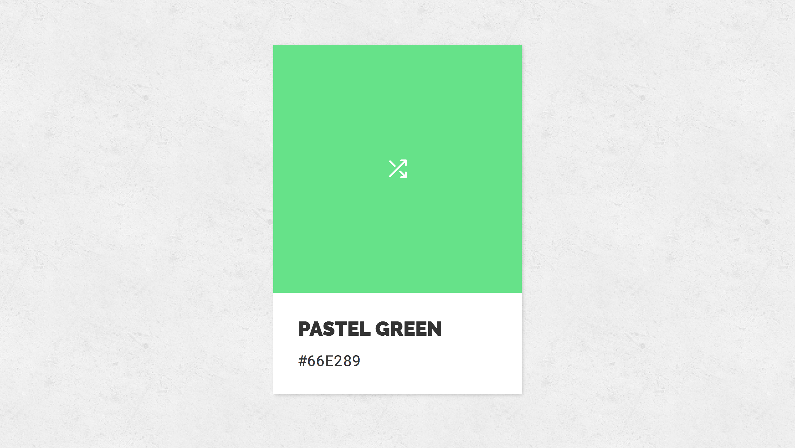

# Name that Swatch!

Nice little random color swatch generator built in React.js.
Yes, it names what it generates!

## Getting Started

### Prerequisites

* [Node.js](https://nodejs.org/en/)

### Installing

1. Clone this repo
2. `yarn` or `npm i`
3. `yarn start` or `npm start`
